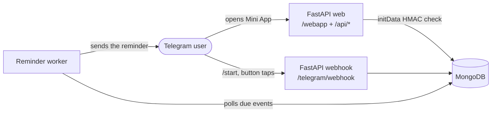

# TimeManager Pro

A Telegram Mini App and bot that remembers dates for you, on the Gregorian and
the Jalali calendar at the same time. Add a birthday, a meeting or an
appointment in the app, and the reminder arrives as a Telegram message with a
one-tap snooze.

[](https://github.com/whamidrezaw/time_manager_pro/actions/workflows/ci.yml)


## Why it exists

Calendar apps assume you live in one calendar system. If half of the dates
that matter to you are Jalali and the other half Gregorian, you end up
converting them in your head or keeping two lists. TimeManager Pro stores one
event and shows you both dates, then reaches you where you already are: in
Telegram, with no extra app to install and no account to create.

## Features

- **Dual calendar.** Every event carries both its Gregorian and its Jalali date.
- **Reminders in Telegram.** A message arrives at the hour and minute you chose,
  in your own timezone, with a *Snooze 1h* button and a deep link back to the event.
- **Recurring events.** Daily, weekly, monthly and yearly, with an optional end
  date. Month-end dates roll correctly through short months, and 29 February
  is handled on non-leap years.
- **Categories, pinning and notes.** Nine categories, pinned events at the top,
  and a 2000-character note on any event.
- **Search and filters.** Filter by category or pinned status, or search across
  titles, notes and both date formats.
- **Follows your Telegram theme.** Colours, dark mode and the native date
  pickers all track the theme you picked in Telegram.

## Screenshots

> To do: add screenshots of the event list, the composer sheet and a reminder
> message. A short GIF of adding an event and receiving the reminder is the
> single highest-value addition to this page.

## How it works



Requests from the Mini App carry Telegram's `initData` string. The server
recomputes its HMAC-SHA256 signature with the bot token, checks the timestamp
for freshness, and only then trusts the user id inside. Every read and write is
scoped to that id, so one user can never reach another user's events.

The reminder worker claims each due event by flipping its status to
`processing` before sending, and re-queues anything left processing for too
long. That makes a crash mid-send safe, and lets more than one worker run at
once without sending a reminder twice.

## Tech stack

| Layer | Choice |
|---|---|
| API | FastAPI, Pydantic v2, Uvicorn / Gunicorn |
| Database | MongoDB via Motor, with TTL and compound indexes |
| Bot | python-telegram-bot |
| Front end | Vanilla JavaScript, no build step, Jinja2 template |
| Dates | `zoneinfo` for timezones, `jdatetime` for the Jalali calendar |
| Quality | ruff, pytest, GitHub Actions |

## Getting started

Requirements: Python 3.12, a MongoDB instance (local or Atlas), and a bot
token from [@BotFather](https://t.me/BotFather).

```bash
git clone https://github.com/whamidrezaw/time_manager_pro.git
cd time_manager_pro

python -m venv .venv
source .venv/bin/activate          # Windows: .venv\Scripts\activate
pip install -r requirements.txt

cp .env.example .env               # then fill in the real values
```

Run the web app and the worker in two terminals:

```bash
./deploy/run-dev.sh                # uvicorn on http://127.0.0.1:8000
./deploy/run-worker.sh             # the reminder loop
```

The Mini App only runs inside Telegram, because it needs the `initData` that
Telegram injects. To try it locally, expose port 8000 with a tunnel, set
`WEBAPP_BASE_URL` to the tunnel URL, and point your bot's menu button there
in BotFather.

## Configuration

Everything is read from environment variables; see `.env.example` for the full
list with comments.

| Variable | Purpose |
|---|---|
| `BOT_TOKEN` | Bot token from BotFather |
| `TELEGRAM_WEBHOOK_SECRET` | Shared secret Telegram echoes back on every webhook call |
| `MONGO_URI`, `MONGO_DB_NAME` | Database connection |
| `WEBAPP_BASE_URL` | Public base URL; the webhook is registered against it at startup |
| `TELEGRAM_BOT_USERNAME`, `TELEGRAM_MINI_APP_SHORT_NAME` | Used to build deep links |
| `RATE_LIMIT_COUNT` | Requests allowed per user per minute |
| `MAX_EVENTS_PER_USER`, `MAX_TITLE_LEN`, `MAX_NOTE_LEN` | Per-user limits (`MAX_EVENTS_PER_USER` is the hard ceiling) |
| `EVENT_LIMIT_BASE`, `REFERRAL_STEP`, `REFERRAL_BONUS` | Referral reward: start at 20 events, +20 per 3 valid invites |
| `REMINDER_POLL_INTERVAL_SECS`, `REMINDER_BATCH_SIZE`, `STALE_PROCESSING_SECS` | Worker tuning |

## Tests

```bash
ruff check .
pytest
```

The suite covers the HMAC verification path, timestamp validation, rate
limiting, date and recurrence maths, the event API, and the webhook.

## Deployment

The `Dockerfile` builds the reminder worker; `fly.toml` deploys it to Fly.io.
`.github/workflows/reminder.yml` runs the same job on a schedule as a
fallback, with a healthchecks.io dead-man's switch. `deploy/systemd/` holds
unit files for a plain VPS.

## Project structure

```
app/
  main.py            FastAPI app, lifespan, webhook registration
  config.py          Settings, validated at startup
  db.py              Mongo connection and index setup
  routes/            web, events API, telegram webhook, health
  services/          auth (initData + rate limit), events, reminders
  schemas/           request and response models
  utils/             timezone, Jalali and recurrence helpers
worker/              the reminder loop and a one-shot runner
static/, templates/  the Mini App
tests/
```

## Roadmap

- Times of day on events, not only dates
- Server-side search and filtering
- Persian interface with full RTL support
- A real Jalali date picker
- Month and agenda views
- `/today` and `/week` commands, and a morning digest

## License

MIT, see [LICENSE](LICENSE).
